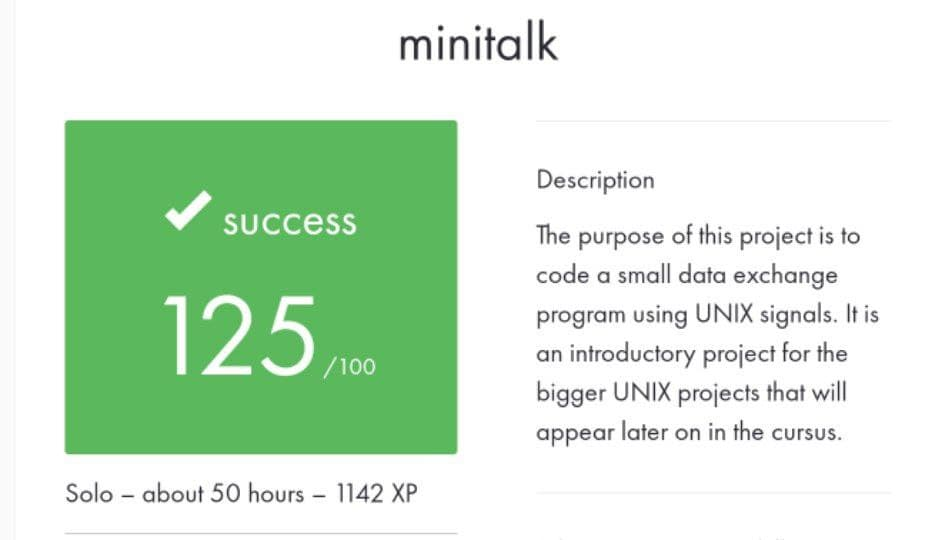

# minitalk

Subject is in the file MiniTalk.pdf.

P.S. These are educational works, they were limited by certain conditions and rules for writing code. Therefore, do not be surprised that everything is output through write or the while loop is used everywhere, etc. =)

